# ExactlyOne Type - Visual Guide

This document contains Mermaid diagrams to help visualize the `ExactlyOne` type and functional programming concepts.

## 1. The ExactlyOne Data Type Structure

```mermaid
graph TD
    A["data ExactlyOne a = ExactlyOne a"] --> B[Constructor wraps exactly one value]
    B --> C["ExactlyOne 5<br/>(Integer in a box)"]
    B --> D["ExactlyOne \"hello\"<br/>(String in a box)"]
    B --> E["ExactlyOne True<br/>(Boolean in a box)"]

    C --> F["📦 Box containing: 5"]
    D --> G["📦 Box containing: \"hello\""]
    E --> H["📦 Box containing: True"]

    style A fill:#e1f5fe,stroke:#01579b,stroke-width:2px
    style F fill:#c8e6c9,stroke:#2e7d32,stroke-width:2px
    style G fill:#c8e6c9,stroke:#2e7d32,stroke-width:2px
    style H fill:#c8e6c9,stroke:#2e7d32,stroke-width:2px
```

## 2. Core Operations Flow

```mermaid
flowchart TD
    subgraph "runExactlyOne - Extract Value"
        A1["📦 ExactlyOne 5"] --> B1["🔓 Open box"]
        B1 --> C1["5 (unwrapped)"]
    end

    subgraph "mapExactlyOne - Transform Contents"
        A2["📦 ExactlyOne 5"] --> B2["🔄 Apply function (+1)"]
        B2 --> C2["📦 ExactlyOne 6"]
        D2["Function: a → b"] --> B2
    end

    subgraph "bindExactlyOne - Chain Operations"
        A3["📦 ExactlyOne 5"] --> B3["🔗 Apply function that returns new box"]
        B3 --> C3["📦 ExactlyOne \"five\""]
        D3["Function: a → ExactlyOne b"] --> B3
    end

    style A1 fill:#fff3e0,stroke:#ef6c00
    style A2 fill:#fff3e0,stroke:#ef6c00
    style A3 fill:#fff3e0,stroke:#ef6c00
    style C1 fill:#e8f5e8,stroke:#2e7d32
    style C2 fill:#e8f5e8,stroke:#2e7d32
    style C3 fill:#e8f5e8,stroke:#2e7d32
```



## 3. Type Class Hierarchy

```mermaid
graph TD
    A[Functor 🗺️] --> B[Applicative 🔧]
    B --> C[Monad ⛓️]

    A --> A1["fmap :: (a → b) → f a → f b<br/>Transform contents while preserving structure"]
    B --> B1["pure :: a → f a<br/>Wrap a value in the context"]
    B --> B2["<*> :: f (a → b) → f a → f b<br/>Apply a wrapped function to a wrapped value"]
    C --> C1[">>=  :: f a → (a → f b) → f b<br/>Chain computations in sequence"]

    subgraph "ExactlyOne Instances"
        E1["fmap = M.liftM"]
        E2["pure = ExactlyOne"]
        E3["<*> = M.ap"]
        E4[">>= = flip bindExactlyOne"]
    end

    A1 --> E1
    B1 --> E2
    B2 --> E3
    C1 --> E4

    style A fill:#ffeb3b,stroke:#f57f17,stroke-width:2px
    style B fill:#4caf50,stroke:#1b5e20,stroke-width:2px
    style C fill:#2196f3,stroke:#0d47a1,stroke-width:2px
```



## 4. Functor Operation (fmap) Step by Step

```mermaid
flowchart LR
    subgraph "Input"
        A["📦 ExactlyOne 5"]
    end

    subgraph "Function"
        B["f = (+1)<br/>Add 1 to number"]
    end

    subgraph "Process"
        C["🔓 Pattern match<br/>ExactlyOne a"]
        D["🔄 Apply f to a<br/>f(5) = 6"]
        E["📦 Wrap result<br/>ExactlyOne 6"]
    end

    subgraph "Output"
        F["📦 ExactlyOne 6"]
    end

    A --> C
    B --> D
    C --> D
    D --> E
    E --> F

    style A fill:#fff3e0
    style F fill:#e8f5e8
    style D fill:#e3f2fd
```



## 5. Monad Bind (>>=) Operation

```mermaid
flowchart TD
    subgraph "Input"
        A["📦 ExactlyOne 5"]
    end

    subgraph "Monadic Function"
        B["f :: Int → ExactlyOne String<br/>f x = ExactlyOne (show x)"]
    end

    subgraph "Bind Process"
        C["🔓 Extract: 5"]
        D["🔄 Apply f: f(5)"]
        E["📦 Get: ExactlyOne \"5\""]
        F["✅ Return directly<br/>(no double wrapping!)"]
    end

    subgraph "Output"
        G["📦 ExactlyOne \"5\""]
    end

    A --> C
    B --> D
    C --> D
    D --> E
    E --> F
    F --> G

    style C fill:#ffeb3b
    style F fill:#4caf50
    style G fill:#e8f5e8
```



## 6. Why flip bindExactlyOne?


## 7. Complete ExactlyOne Ecosystem

```mermaid
graph TB
    subgraph "Data Definition"
        A["data ExactlyOne a = ExactlyOne a<br/>📦 Simple wrapper type"]
    end

    subgraph "Core Operations"
        B["runExactlyOne<br/>🔓 Extract value"]
        C["mapExactlyOne<br/>🗺️ Transform contents"]
        D["bindExactlyOne<br/>⛓️ Chain operations"]
    end

    subgraph "Type Class Instances"
        E["Functor<br/>fmap = M.liftM<br/>🗺️ Mapping capability"]
        F["Applicative<br/>pure = ExactlyOne<br/><*> = M.ap<br/>🔧 Function application"]
        G["Monad<br/>>>= = flip bindExactlyOne<br/>⛓️ Sequential computation"]
    end

    subgraph "Benefits"
        H["🔄 Standard FP Patterns"]
        I["🧩 Composable Operations"]
        J["🛡️ Type Safety"]
        K["🎭 Abstraction"]
    end

    A --> B
    A --> C
    A --> D

    C --> E
    B --> F
    C --> F
    D --> G

    E --> H
    F --> I
    G --> J
    A --> K

    style A fill:#e1f5fe,stroke:#01579b,stroke-width:3px
    style H fill:#c8e6c9,stroke:#2e7d32,stroke-width:2px
    style I fill:#c8e6c9,stroke:#2e7d32,stroke-width:2px
    style J fill:#c8e6c9,stroke:#2e7d32,stroke-width:2px
    style K fill:#c8e6c9,stroke:#2e7d32,stroke-width:2px
```



## 8. Real-World Analogy

```mermaid
graph LR
    subgraph "Physical World"
        A["🎁 Gift Box"] --> B["Contains 1 item"]
        C["✉️ Envelope"] --> D["Contains 1 letter"]
        E["🍪 Cookie Jar"] --> F["Contains 1 cookie"]
    end

    subgraph "ExactlyOne World"
        G["📦 ExactlyOne a"] --> H["Contains exactly 1 value of type a"]
    end

    subgraph "Operations"
        I["🔓 Open & Transform"] --> J["mapExactlyOne"]
        K["⛓️ Chain Operations"] --> L["bindExactlyOne"]
        M["📤 Extract Contents"] --> N["runExactlyOne"]
    end

    B --> H
    D --> H
    F --> H

    H --> J
    H --> L
    H --> N

    style G fill:#e1f5fe,stroke:#01579b,stroke-width:2px
```



## 9. Function Signatures Visualization

```mermaid
graph TD
    subgraph "Function Types"
        A["runExactlyOne :: ExactlyOne a → a<br/>📦 → 📄"]
        B["mapExactlyOne :: (a → b) → ExactlyOne a → ExactlyOne b<br/>🔄 → 📦 → 📦"]
        C["bindExactlyOne :: (a → ExactlyOne b) → ExactlyOne a → ExactlyOne b<br/>⛓️ → 📦 → 📦"]
    end

    subgraph "What They Do"
        D["Unwraps the value<br/>Removes the box"]
        E["Transforms value inside<br/>Keeps it boxed"]
        F["Applies function that creates new box<br/>Avoids double-boxing"]
    end

    A --> D
    B --> E
    C --> F

    style A fill:#ffcdd2
    style B fill:#c8e6c9
    style C fill:#bbdefb
```



## 10. Why Use ExactlyOne?


These diagrams show how `ExactlyOne` is the simplest possible demonstration of functional programming patterns that scale to much more complex types!
