# ExactlyOne: A Beginner's Guide to Functional Programming

This document explains     subgraph "🚴 Learning Journey"
        A["👶 ExactlyOne Training wheels Simple & safe"] --> B["🧒 Maybe Sometimes it works Sometimes it doesn't"] 
        B --> C["👦 List Multiple possibilities Lots of options"]
        C --> D["👨 IO Real world Anything can happen"]tional programming concepts using simple analogies and pictu    subgraph "Mixing Process"
        D["🔧 Step 1:    subgraph "Chain Reaction"
        C["🔓 Open box: Get 10"]
        D["🔄 Use function: divide10By 10 = ExactlyOne Result: 1"]
        E["📦 Get new box directly (No double-boxing!)"]
    end
    
    subgraph "Why Not Transform?"
        F["⌠If we used transform (fmap): We'd get: ExactlyOne (ExactlyOne Result: 1) That's a box inside a box! 😵"]
    end
    
    subgraph "Real Code"
        G["ExactlyOne 10 >>= divide10By = ExactlyOne Result: 1"]
    enderation and mix it with 5"]
        E["📦 Result: ExactlyOne (5+) (Box with 5 plus something)"]
        F["🔧 Step 2: Take 5 plus something and mix it with 3"]
        G["📦 Final: ExactlyOne 8 (Box with 5+3=8)"]
    end Think of `ExactlyOne` as a **labeled box** that always contains exactly one item.

## 1. What is ExactlyOne? (Think: A Simple Box)

## 2. Three Magic Powers: Transform, Combine, and Chain

Think of these as three different **superpowers** you can use with your boxes:

```mermaid
graph LR
    subgraph "🗺️ TRANSFORM (Functor)"
        A1["📦 Box with 5"] --> A2["🪄 Magic wand: +1"] --> A3["📦 Box with 6"]
        A4["Keep the box, change what's inside"]
    end

    subgraph "🔧 COMBINE (Applicative)"
        B1["📦 Box with (+)"] --> B4["📦 Box with 8"]
        B2["📦 Box with 5"] --> B4
        B3["📦 Box with 3"] --> B4
        B5["Take multiple boxes, combine their contents"]
    end

    subgraph "⛓️ CHAIN (Monad)"
        C1["📦 Box with 5"] --> C2["🔗 Chain reaction:<br/>Turn 5 into a new box"] --> C3["📦 Box with five"]
        C4["Use contents to create the next box"]
    end

    A3 --> A4
    B4 --> B5
    C3 --> C4

    style A1 fill:#fff3e0
    style A3 fill:#fff3e0
    style B4 fill:#e8f5e8
    style C3 fill:#e1f5fe
```

## 3. Why Learn with ExactlyOne? (It's Like Training Wheels!)

```mermaid
graph TD
    subgraph "🚴 Learning Journey"
        A["� ExactlyOne<br/>Training wheels<br/>Simple & safe"] --> B["🧒 Maybe<br/>Sometimes it works<br/>Sometimes it doesn't"]
        B --> C["� List<br/>Multiple possibilities<br/>Lots of options"]
        C --> D["👨 IO<br/>Real world<br/>Anything can happen"]
    end

    subgraph "Why Start Simple?"
        E["✅ Always works<br/>Never fails"]
        F["✅ Only one value<br/>No confusion"]
        G["✅ Learn patterns<br/>Without complexity"]
        H["✅ Build confidence<br/>Step by step"]
    end

    A --> E
    A --> F
    A --> G
    A --> H

    style A fill:#c8e6c9,stroke:#2e7d32,stroke-width:3px
    style E fill:#e8f5e8
    style F fill:#e8f5e8
    style G fill:#e8f5e8
    style H fill:#e8f5e8
```

## 4. 🗺️ TRANSFORM Power (Like a Magic Wand)

Imagine you have a **magic wand** that can transform what's inside any box, but the box stays the same!

```mermaid
flowchart LR
    subgraph "Before Magic"
        A["📦 ExactlyOne 5<br/>(Box containing number 5)"]
    end

    subgraph "Magic Wand"
        B["🪄 +1<br/>(Add one to any number)"]
    end

    subgraph "Magic Happens"
        C["✨ Open box carefully"]
        D["🔄 Wave wand: 5 becomes 6"]
        E["📦 Put 6 back in same type of box"]
    end

    subgraph "After Magic"
        F["📦 ExactlyOne 6<br/>(Same box, new contents!)"]
    end

    A --> C
    B --> D
    C --> D
    D --> E
    E --> F

    subgraph "Real Code"
        G["fmap (+1) (ExactlyOne 5)<br/>= ExactlyOne 6"]
    end

    F --> G

    style A fill:#fff3e0,stroke:#ef6c00,stroke-width:2px
    style F fill:#e8f5e8,stroke:#2e7d32,stroke-width:2px
    style D fill:#ffeb3b
    style G fill:#e1f5fe
```

**In simple words:** "Transform what's inside, keep the container the same!"

## 5. 🔧 COMBINE Power (Like a Mixer)

Imagine you have multiple boxes and want to **mix their contents together**!

**In simple words:** "Take multiple boxes, combine what's inside them!"

## 6. ⛓️ CHAIN Power (Like Dominoes)

Imagine setting up **dominoes** where each domino creates the next one based on what it contains!

**In simple words:** "Use what's in one box to create the next box in the chain!"

## 7. The Mysterious "flip" - Why Our Code Looks Different

This is like having a **left-handed** vs **right-handed** tool!

```mermaid
flowchart TD
    subgraph "What Haskell Expects"
        A["🤝 Standard handshake:<br/>value >>= function<br/>Hi there >>= makeUppercase"]
    end

    subgraph "What Our Code Does"
        B["🤝 Backwards handshake:<br/>function value<br/>makeUppercase Hi there"]
    end

    subgraph "The Translator (flip)"
        C["🔄 flip = 'Switch the order!'<br/>Takes our backwards version<br/>and makes it forwards"]
    end

    subgraph "Example in Action"
        D["😊 What we want:<br/>ExactlyOne 5 >>= (multiply by 2)"]
        E["🔧 What our code does:<br/>bindExactlyOne (multiply by 2) (ExactlyOne 5)"]
        F["🔄 flip fixes it:<br/>flip bindExactlyOne = standard order"]
        G["✅ Result: ExactlyOne 10"]
    end

    A --> C
    B --> C
    C --> D
    D --> E
    E --> F
    F --> G

    style A fill:#e8f5e8
    style B fill:#ffcdd2
    style C fill:#fff3e0
    style G fill:#e1f5fe
```

**In simple words:** "`flip` just switches the order of inputs to match what Haskell expects!"

## 8. When to Use Each Power? (Decision Helper)

```mermaid
flowchart TD
    subgraph "🤔 What Do You Want To Do?"
        A["Start here: What's your goal?"]
    end

    subgraph "🗺️ TRANSFORM Situations"
        B["� Change what's inside<br/>📊 Convert types<br/>🔢 Do math on contents<br/>📏 Measure something"]
        B1["Use: fmap or <$><br/>Example: fmap (+1) (ExactlyOne 5)"]
    end

    subgraph "🔧 COMBINE Situations"
        C["➕ Add multiple things<br/>🧮 Calculate with many inputs<br/>📋 Build from parts<br/>🎨 Merge data"]
        C1["Use: <*> or liftA2<br/>Example: (+) <$> box1 <*> box2"]
    end

    subgraph "⛓️ CHAIN Situations"
        D["� Next step depends on current result<br/>📦 Function returns a new box<br/>🚪 Decision-making<br/>🔄 Multi-step process"]
        D1["Use: >>= or do<br/>Example: box >>= makeNewBox"]
    end

    A --> B
    A --> C
    A --> D

    B --> B1
    C --> C1
    D --> D1

    style A fill:#fff3e0,stroke:#ef6c00,stroke-width:3px
    style B1 fill:#ffeb3b
    style C1 fill:#4caf50
    style D1 fill:#2196f3
```

## 9. Your Learning Journey: From Simple to Amazing!

```mermaid
graph TD
    subgraph "🎓 Learning Path"
        A["👶 Level 1: ExactlyOne<br/>🎯 Perfect practice<br/>✅ Always works<br/>📦 One value only"]

        B["🧒 Level 2: Maybe<br/>❓ Sometimes works<br/>❌ Sometimes fails<br/>🤷 Maybe something, maybe nothing"]

        C["👦 Level 3: List<br/>🔄 Many possibilities<br/>📊 Multiple results<br/>🎲 Choose your adventure"]

        D["👨 Level 4: IO<br/>🌍 Real world<br/>💾 File operations<br/>🌐 Network calls<br/>🖥️ User input"]
    end

    subgraph "🎪 Same Tricks, Different Shows"
        E["🗺️ Transform: Works everywhere!<br/>🔧 Combine: Works everywhere!<br/>⛓️ Chain: Works everywhere!"]
    end

    A --> B
    B --> C
    C --> D

    A --> E
    B --> E
    C --> E
    D --> E

    style A fill:#c8e6c9,stroke:#2e7d32,stroke-width:3px
    style E fill:#fff3e0,stroke:#ef6c00,stroke-width:2px
```

**The Amazing Thing:** Once you learn these three powers with `ExactlyOne`, you can use them with ANYTHING in Haskell!

## 10. Quick Examples: See the Powers in Action!

```mermaid
graph TD
    subgraph "🗺️ TRANSFORM Examples"
        A1["📦 ExactlyOne 5<br/>🪄 Add 1<br/>📦 ExactlyOne 6"]
        A2["📦 ExactlyOne hello<br/>🪄 Make uppercase<br/>📦 ExactlyOne HELLO"]
        A3["📦 ExactlyOne True<br/>🪄 Convert to text<br/>📦 ExactlyOne True"]
    end

    subgraph "🔧 COMBINE Examples"
        B1["📦 (+) + 📦 5 + 📦 3<br/>🔧 Mix together<br/>📦 ExactlyOne 8"]
        B2["📦 concat + 📦 Hi + 📦 There<br/>🔧 Mix together<br/>📦 ExactlyOne HiThere"]
    end

    subgraph "⛓️ CHAIN Examples"
        C1["📦 ExactlyOne 10<br/>🔗 x → ExactlyOne (x/2)<br/>📦 ExactlyOne 5"]
        C2["📦 ExactlyOne hello<br/>🔗 s → ExactlyOne (length s)<br/>📦 ExactlyOne 5"]
    end

    style A1 fill:#fff3e0
    style A2 fill:#fff3e0
    style A3 fill:#fff3e0
    style B1 fill:#e8f5e8
    style B2 fill:#e8f5e8
    style C1 fill:#e1f5fe
    style C2 fill:#e1f5fe
```

## 11. Why Does the Code Look So Weird? (Behind the Scenes)

```mermaid
flowchart TD
    subgraph "🤔 The Mystery"
        A["❓ Why use M.liftM instead of our mapExactlyOne?<br/>❓ Why use M.ap instead of direct implementation?"]
    end

    subgraph "🎭 The Philosophy"
        B["🏗️ Build the most powerful tool first (CHAIN)<br/>🔧 Use that tool to build simpler tools<br/>✅ Everything works together perfectly"]
    end

    subgraph "🔨 The Practice"
        C["⛓️ We already have CHAIN power (>>=)<br/>🗺️ TRANSFORM can be built from CHAIN<br/>🔧 COMBINE can be built from CHAIN"]
    end

    subgraph "🎯 The Result"
        D["🤝 Everything is consistent<br/>🧩 All pieces fit together<br/>📏 Mathematical perfection<br/>🛡️ No bugs or surprises"]
    end

    A --> B
    B --> C
    C --> D

    style A fill:#fff3e0
    style B fill:#e1f5fe
    style C fill:#e8f5e8
    style D fill:#c8e6c9
```

**In simple words:** "Build the hardest thing first, then use it to build easier things!"

## 12. Your Cheat Sheet: What to Remember

```mermaid
graph TD
    subgraph "📋 Quick Reference"
        A["🗺️ TRANSFORM (fmap/<$>)<br/>• Change what's inside<br/>• Keep the box the same<br/>• One input → One output"]

        B["🔧 COMBINE (<*>/liftA2)<br/>• Mix multiple boxes<br/>• All inputs are independent<br/>• Many inputs → One output"]

        C["⛓️ CHAIN (>>=)<br/>• Next step depends on previous<br/>• Each step makes a new box<br/>• Sequential steps"]
    end

    subgraph "🎯 When in Doubt"
        D["❓ Ask yourself:<br/>• Am I changing what's inside? → TRANSFORM<br/>• Am I mixing things together? → COMBINE<br/>• Does the next step depend on this result? → CHAIN"]
    end

    subgraph "💡 Remember"
        E["ExactlyOne is your friend!<br/>🎓 Practice here first<br/>🚀 Then tackle harder types<br/>✨ Same patterns everywhere"]
    end

    style A fill:#ffeb3b,stroke:#f57f17,stroke-width:2px
    style B fill:#4caf50,stroke:#1b5e20,stroke-width:2px
    style C fill:#2196f3,stroke:#0d47a1,stroke-width:2px
    style D fill:#fff3e0,stroke:#ef6c00,stroke-width:2px
    style E fill:#e1f5fe,stroke:#01579b,stroke-width:2px
```

---

## 🎉 Congratulations!

You now understand the three fundamental powers of functional programming:

1. **🗺️ TRANSFORM** - Change what's inside boxes
2. **🔧 COMBINE** - Mix multiple boxes together
3. **⛓️ CHAIN** - Create sequences where each step depends on the previous

These same patterns work with **every type** in Haskell! You've just learned the secret language that makes functional programming so powerful and elegant.

**Next Steps:**

- Practice with `ExactlyOne` until these feel natural
- Then try `Maybe` (boxes that might be empty)
- Then try `List` (boxes with multiple items)
- Eventually tackle `IO` (boxes that interact with the real world)

Remember: You already know the patterns - you're just applying them to different types of boxes!
